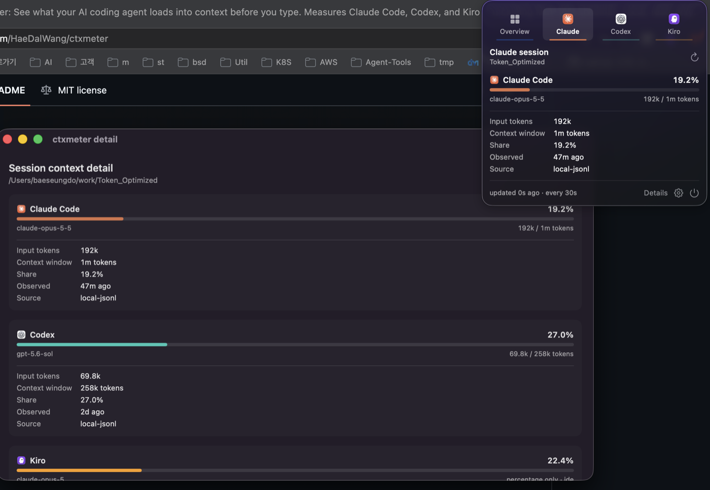
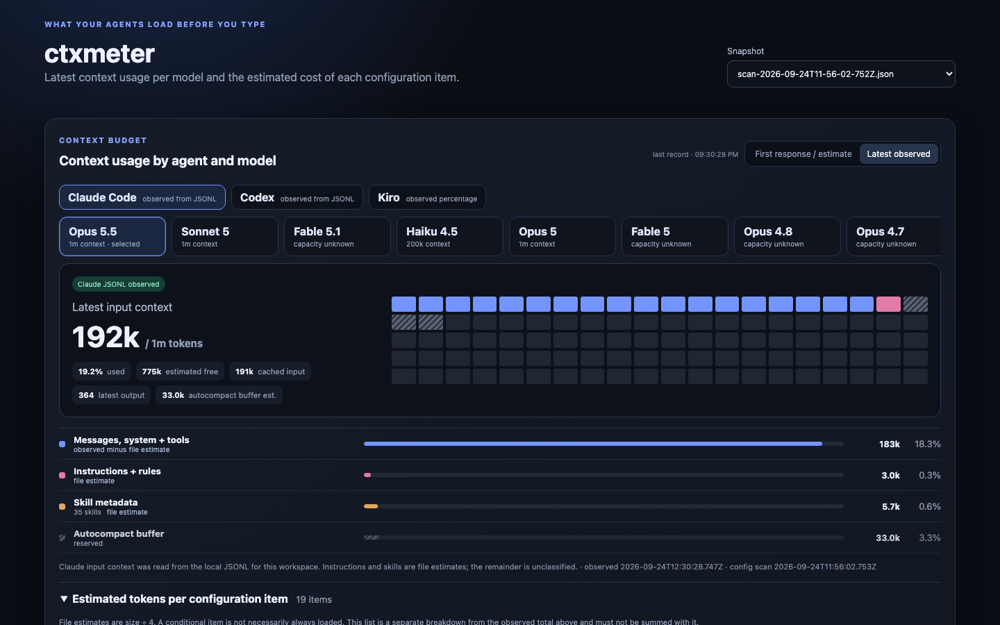

<h1 align="center">ctxmeter</h1>

<p align="center"><b>Your AI coding agent burns tens of thousands of tokens before you type a single character.<br/>This tells you how many, where they went, and switches off the ones you pick.</b></p>

<p align="center">
  <a href="LICENSE"></a>
  
  
  
</p>

```bash
npx ctxmeter
```

<p align="center"></p>

Skills, rule files, steering docs, hooks, and MCP servers all load at session start. You find out when compaction hits. One command, no config, no account, nothing leaves your machine.

## Quickstart

```bash
# 1. What does my setup cost right now?
npx ctxmeter

# 2. Include MCP tool schemas, the biggest and least visible cost.
#    This one starts your servers, so it is opt-in. See what it would run first:
npx ctxmeter mcp-scan --dry-run
npx ctxmeter mcp-scan --i-understand-this-launches-servers

# 3. Switch the expensive ones off. Dry run first; --apply backs up and prints the undo.
npx ctxmeter fix
npx ctxmeter fix --apply codex/code-review-graph

# 4. Watch live occupancy from the macOS menu bar.
git clone https://github.com/HaeDalWang/ctxmeter && cd ctxmeter/menubar
make install     # then launch CtxmeterBar from /Applications

# Everything else
npx ctxmeter --help
```

Measure, then act. Three surfaces over the same numbers: a one-shot CLI audit, a menu bar app for live occupancy, and a local web dashboard for per-file detail.

## Why you might want this

**You keep hitting compaction earlier than expected.** Reported in the wild: [20% of the window gone before the first message](https://github.com/anthropics/claude-code/issues/50133), [50k+ tokens for a fresh "hello"](https://github.com/anthropics/claude-code/issues/84490), [83.3k tokens immediately after `/clear`](https://www.reddit.com/r/ClaudeCode/comments/1mwxfit/), [one MCP server measured at 125,964 tokens](https://github.com/anthropics/claude-code/issues/12241). Step one is finding out which files and servers are responsible.

**You installed a plugin bundle and forgot.** One skill group can list hundreds of skills, and every one contributes frontmatter at startup. ctxmeter ranks them so the biggest is the first line you read.

**You run more than one agent.** Claude Code, Codex, and Kiro each keep their own skills, rules, hooks, and MCP config in their own layout. This reads all three and puts them side by side — the only tool that does.

## Measuring MCP, the part nobody else measures

MCP tool schemas are the largest reported cost, and they exist **only in the live prompt** — no local file contains them. So measuring honestly means starting each server and asking it.

That contradicts a read-only promise, so it is a separate command behind an explicit flag:

```bash
ctxmeter mcp-scan --dry-run     # exactly what would be started, env names only
ctxmeter mcp-scan --i-understand-this-launches-servers
```

```
MCP tool schemas cost 21,076 tokens across 81 tools.

  codex/code-review-graph: 7,298 tokens, 30 tools
  kiro/playwright: 4,352 tokens, 25 tools
  kiro/aws-mcp: 2,892 tokens, 8 tools
  claude/aws-knowledge-mcp-server: 1,875 tokens, 5 tools
  claude/awslabs.aws-api-mcp-server: 1,865 tokens, 2 tools
  kiro/context7: 1,148 tokens, 2 tools
  codex/shadcn: 1,124 tokens, 7 tools
  kiro/exa: 522 tokens, 2 tools
  codex/node_repl: failed — exited before answering
```

Per-server timeouts, hard kills, remote servers skipped unless you opt in, and schemas discarded after counting. Servers you have switched off are never started. The result is cached so `ctxmeter` folds it into the audit.

## Then switch the expensive ones off

Knowing the number is half of it. `fix` turns each finding into one edit, and the edit is always a single key because every harness already ships a disable flag.

```bash
ctxmeter fix                                  # dry run, changes nothing
ctxmeter fix --apply codex/code-review-graph  # one target at a time
```

```
21,486 tokens sit behind 10 switches you can flip.

     7,298  codex/code-review-graph, 30 tools
            [mcp_servers.code-review-graph] in ~/.codex/config.toml
     4,352  kiro/playwright, 25 tools
            "playwright" in ~/.kiro/settings/mcp.json
     2,892  kiro/aws-mcp, 8 tools
            "aws-mcp" in ~/.kiro/settings/mcp.json
       322  codex/plugin:github@openai-curated, 4 skills
            [plugins."github@openai-curated"] in ~/.codex/config.toml

Nothing has been changed. To switch one off:
  ctxmeter fix --apply codex/code-review-graph
```

Applying writes a backup next to the original and prints the undo command:

```
Switched off codex/code-review-graph, freeing about 7,298 tokens at startup.

  changed  ~/.codex/config.toml
  backup   ~/.codex/config.toml.ctxmeter-2026-09-24T13-43-48-623Z.bak

To undo:
  cp '~/.codex/config.toml.ctxmeter-2026-09-24T13-43-48-623Z.bak' '~/.codex/config.toml'
```

TOML is edited line by line and never reserialized, so comments and the other 78 sections keep their bytes. JSON is reserialized but only after a round trip proves the key order and the edit survived; a file that will not parse is refused rather than repaired. There is no bulk apply, and there is no undo log — the printed `cp` still works after ctxmeter is uninstalled.

**It will not touch your writing.** `CLAUDE.md`, `AGENTS.md`, rule files, and steering documents are reported but never edited. Turning off an MCP server is a setting; moving your rule file is editing your work.

## The macOS menu bar app

One icon and one number in the menu bar: how full the context window of the agent you are watching actually is, refreshed every 30 seconds. Click for a per-agent breakdown, `Details` for all three side by side.

<p align="center"></p>

```bash
cd menubar
make install     # /Applications/CtxmeterBar.app
make run         # or just run it from the build directory
```

Swift and SwiftPM only; full Xcode is not required. Agent icons are read from the vendor apps installed on your Mac, so no trademarked artwork ships in this repo. Refresh costs about 0.45% of one core at the default interval, because it reads session usage only and skips the inventory scan. [Details](menubar/README.md).

## The web dashboard

```bash
npx ctxmeter dashboard        # 127.0.0.1:4318, localhost only
```

Per-harness context maps, collapsible per-file cost, and live session numbers polled while the tab is visible. This is where per-item configuration cost lives — the menu bar app deliberately shows occupancy only.

<p align="center"></p>

## What it never does

No prompt text, rule text, skill bodies, or credentials are copied. No network connection except MCP servers you explicitly opt into. No background watcher, no database, no telemetry. Prompt-history files are never opened. Snapshots hold paths, counts, and byte estimates only — the test suite asserts it.

Two commands step outside read-only, and both require an explicit flag:

| Command | What it does beyond reading | Gate |
|---|---|---|
| `mcp-scan` | starts each configured server to read its tool list | `--i-understand-this-launches-servers` |
| `fix` | sets one key in one config file | `--apply <target>` |

Everything else only reads, and the default invocation of both of those only reads too. `mcp-scan` passes your shell environment through to each server it starts, because servers need `PATH` and `HOME` to run at all. That is how every MCP client works, and it is why the command is opt-in.

## What it cannot tell you

**Static figures are bytes ÷ 4.** A heuristic, not a tokenizer. Claude and Codex session totals are observed exactly; Kiro records only a percentage, so no token count is derived from it.

**Hook output is unmeasurable.** Its size depends on what hooks emit at runtime.

**A model with no known capacity stays unknown.** No context window is ever guessed.

## Commands

| Command | What it does |
|---|---|
| `npx ctxmeter` | audit; ranked startup cost per agent |
| `npx ctxmeter mcp-scan` | measure MCP tool schemas (starts your servers) |
| `npx ctxmeter fix` | list switches that would free tokens; `--apply` to flip one |
| `npx ctxmeter scan` | full inventory snapshot as JSON |
| `npx ctxmeter telemetry` | current session usage as JSON, ~0.2s |
| `npx ctxmeter dashboard` | local web dashboard |
| `npx ctxmeter --help` | every command and flag |
| `cd menubar && make install` | macOS menu bar app |

`--home` and `--workspace` override paths on any command.

## Requirements

Node 20+. The menu bar app needs macOS 14+ and the Swift toolchain; full Xcode is not required.

Tested on macOS. Linux should work and is covered by CI for the Node side. Windows support for `mcp-scan` is implemented but unverified.

## License

MIT. Detailed behaviour and measurement limits in [docs/reference.md](docs/reference.md).
