<h1 align="center">ctxmeter</h1>

<p align="center"><b>Your AI coding agent burns tens of thousands of tokens before you type a single character.<br/>This tells you how many, where they went, and what to delete.</b></p>

<p align="center">
  <a href="LICENSE"></a>
  
  
  
</p>

```bash
npx ctxmeter
```

<p align="center"></p>

Skills, rule files, steering docs, hooks, and MCP servers all load at session start. You find out when compaction hits. One command, no config, no account, nothing leaves your machine.

## Why you might want this

**You keep hitting compaction earlier than expected.** Reported in the wild: [20% of the window gone before the first message](https://github.com/anthropics/claude-code/issues/50133), [50k+ tokens for a fresh "hello"](https://github.com/anthropics/claude-code/issues/84490), [83.3k tokens immediately after `/clear`](https://www.reddit.com/r/ClaudeCode/comments/1mwxfit/), [one MCP server measured at 125,964 tokens](https://github.com/anthropics/claude-code/issues/12241). Step one is finding out which files and servers are responsible.

**You installed a plugin bundle and forgot.** One skill group can list hundreds of skills, and every one contributes frontmatter at startup. ctxmeter ranks them so the biggest is the first line you read.

**You run more than one agent.** Claude Code, Codex, and Kiro each keep their own skills, rules, hooks, and MCP config in their own layout. This reads all three and puts them side by side — the only tool that does.

## Measuring MCP, the part nobody else measures

MCP tool schemas are the largest reported cost, and they exist **only in the live prompt** — no local file contains them. So measuring honestly means starting each server and asking it.

That contradicts a read-only promise, so it is a separate command behind an explicit flag:

```bash
ctxmeter mcp-scan --dry-run     # exactly what would be started, env names only
ctxmeter mcp-scan --i-understand-this-launches-servers
```

```
MCP tool schemas cost 18,813 tokens across 51 tools.

  codex/obsidian: 8,526 tokens, 12 tools
  codex/code-review-graph: 7,298 tokens, 30 tools
  claude/awslabs.aws-api-mcp-server: 1,865 tokens, 2 tools
  codex/shadcn: 1,124 tokens, 7 tools
  claude/aws-knowledge-mcp-server: skipped-remote — rerun with --allow-remote
  codex/cua_repl: timeout — no tools/list within 20000ms
```

Per-server timeouts, hard kills, remote servers skipped unless you opt in, and schemas discarded after counting. The result is cached so `ctxmeter` folds it into the audit.

## Also included

**Web dashboard** — `npm run dashboard`, bound to `127.0.0.1:4318` only. Per-harness context maps, collapsible per-file cost, live session numbers polled while the tab is visible.

**macOS menu bar app** — `cd menubar && make run`. Current occupancy per agent, with vendor icons read from the apps installed on your Mac. [Details](menubar/README.md).

## What it never does

No prompt text, rule text, skill bodies, or credentials are copied. No network connection except MCP servers you explicitly opt into. No background watcher, no database, no telemetry. Prompt-history files are never opened. Snapshots hold paths, counts, and byte estimates only — the test suite asserts it.

## What it cannot tell you

**Static figures are bytes ÷ 4.** A heuristic, not a tokenizer. Claude and Codex session totals are observed exactly; Kiro records only a percentage, so no token count is derived from it.

**Hook output is unmeasurable.** Its size depends on what hooks emit at runtime.

**A model with no known capacity stays unknown.** No context window is ever guessed.

## Commands

| Command | What it does |
|---|---|
| `npx ctxmeter` | audit; ranked startup cost per agent |
| `npx ctxmeter mcp-scan` | measure MCP tool schemas (starts your servers) |
| `npx ctxmeter scan` | full inventory snapshot as JSON |
| `npx ctxmeter telemetry` | current session usage as JSON, ~0.2s |
| `npm run dashboard` | local web dashboard |

`--home` and `--workspace` override paths on any command.

## Requirements

Node 20+. The menu bar app needs macOS 14+ and the Swift toolchain; full Xcode is not required.

## License

MIT. Detailed behaviour and measurement limits in [docs/reference.md](docs/reference.md).
