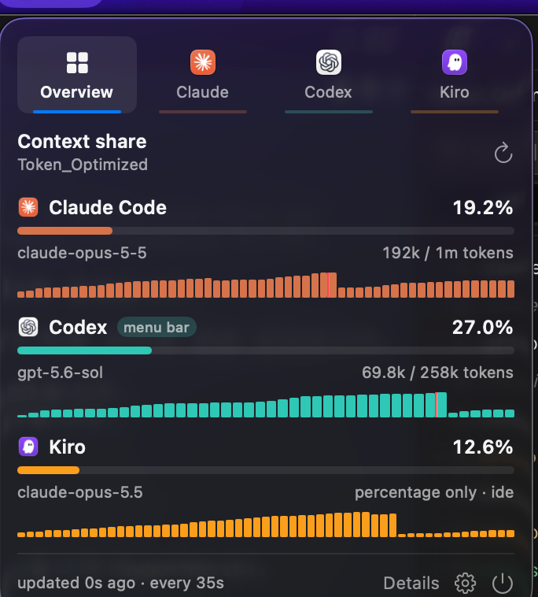
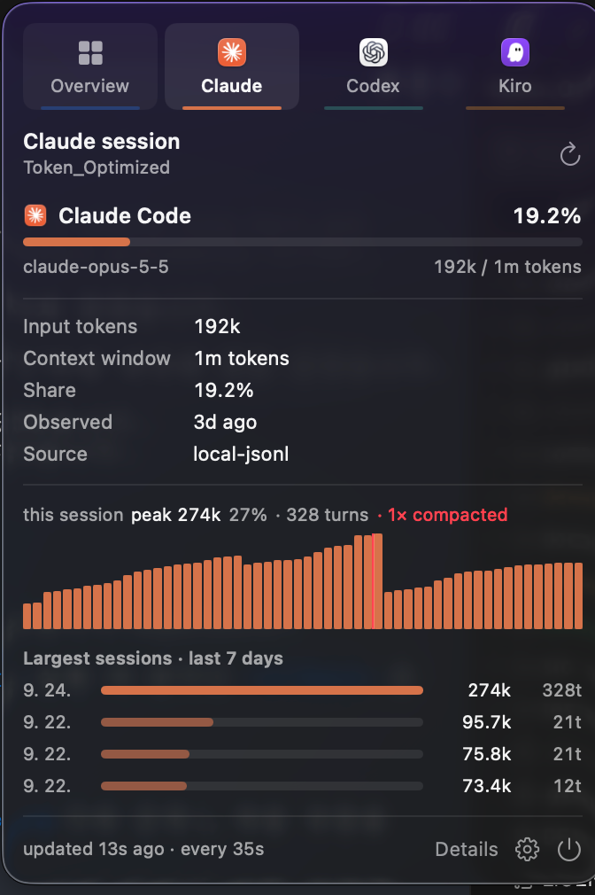
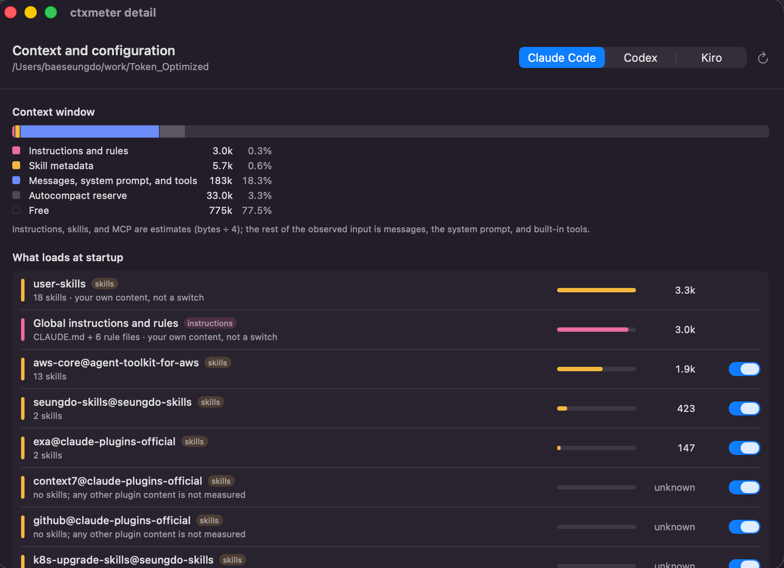

<h1 align="center">ctxmeter</h1>

<p align="center"><b>English</b> · <a href="README.ko.md">한국어</a></p>

<p align="center"><b>Your AI coding agent burns tens of thousands of tokens before you type a single character.<br/>This tells you how many, where they went, and switches off the ones you pick.</b></p>

<p align="center">
  <a href="LICENSE"></a>
  <a href="https://www.npmjs.com/package/ctxmeter"></a>
  
  
  
</p>

```bash
npx ctxmeter
```

<p align="center"></p>

Skills, rule files, steering docs, hooks, and MCP servers all load at session start. You find out when compaction hits. One command, no config, no account, nothing leaves your machine.

## Quickstart

Node 20+. `npx ctxmeter` runs the latest release with nothing installed; `npm i -g ctxmeter` keeps it on your PATH. Below, `ctxmeter` stands for either.

```bash
# 1. What does my setup cost right now?
npx ctxmeter

# 2. Include MCP tool schemas, the cost no local file shows.
#    This one starts your servers, so it is opt-in. See what it would run first:
ctxmeter mcp-scan --dry-run
ctxmeter mcp-scan --i-understand-this-launches-servers

# 3. Switch the expensive ones off. Dry run first; --disable backs up and prints the undo.
ctxmeter fix
ctxmeter fix --disable kiro/playwright           # --enable turns it back on

# Everything else
ctxmeter --help
```

### Menu bar app (macOS 14+)

```bash
xcode-select --install     # Swift command line tools; skip if already installed
brew install node          # skip if node 20+ is already installed
git clone https://github.com/HaeDalWang/ctxmeter.git && cd ctxmeter
./scripts/ctxmeter-bar.sh install
```

1. Open `/Applications/CtxmeterBar.app` from **Finder**, not from a terminal (see below).
2. System Settings → Menu Bar → turn **CtxmeterBar** on.
3. Upgrade later with `git pull && ./scripts/ctxmeter-bar.sh install`. The popover shows when a newer release exists.

**Running but no icon (macOS 26)?** Control Center can keep the app disallowed even with the toggle on, or file it under the disabled terminal that launched it. `./scripts/menubar-allowlist.py` shows the state and `--repair` fixes it, with a backup and a rollback command. It needs Full Disk Access for your terminal. [Why](develop/execution/08-menubar-management.md).

Measure, then act. Two surfaces over the same numbers: the CLI for a one-shot audit and fix, and a menu bar app that charts context per turn and switches items on and off.

## Why you might want this

**You keep hitting compaction earlier than expected.** Reported in the wild: [20% of the window gone before the first message](https://github.com/anthropics/claude-code/issues/50133), [50k+ tokens for a fresh "hello"](https://github.com/anthropics/claude-code/issues/84490), [83.3k tokens immediately after `/clear`](https://www.reddit.com/r/ClaudeCode/comments/1mwxfit/), [one MCP server measured at 125,964 tokens](https://github.com/anthropics/claude-code/issues/12241). Step one is finding out which files and servers are responsible.

**You installed a plugin bundle and forgot.** One skill group can list hundreds of skills, and every one contributes frontmatter at startup. ctxmeter ranks them so the biggest is the first line you read.

**You run more than one agent.** Claude Code, Codex, and Kiro each keep their own skills, rules, hooks, and MCP config in their own layout. This reads all three and puts them side by side — the only tool that does.

## Measuring MCP, the part nobody else measures

MCP tool schemas exist **only in the live prompt** — no local file contains them. So measuring honestly means starting each server and asking it.

Whether they cost anything at startup depends on the agent. Claude Code and Codex keep MCP tools behind a tool search by default and load a schema only when the model looks for it; Kiro documents no such deferral, so ctxmeter counts its servers as loaded. Claude loads everything upfront again if you set `ENABLE_TOOL_SEARCH=false`, point `ANTHROPIC_BASE_URL` at a third-party proxy, or mark a server `alwaysLoad`. ctxmeter reads those settings and reports loaded and deferred separately.

That contradicts a read-only promise, so it is a separate command behind an explicit flag:

```bash
ctxmeter mcp-scan --dry-run     # exactly what would be started, env names only
ctxmeter mcp-scan --i-understand-this-launches-servers
```

```
MCP tool schemas: 8,914 tokens load at startup; 8,963 more load only when a tool is used.

  codex/code-review-graph: 7,298 tokens, 30 tools — deferred
  kiro/playwright: 4,352 tokens, 25 tools
  kiro/aws-mcp: 2,892 tokens, 8 tools
  kiro/context7: 1,148 tokens, 2 tools
  codex/shadcn: 1,124 tokens, 7 tools — deferred
  codex/node_repl: 541 tokens, 4 tools — deferred
  kiro/exa: 522 tokens, 2 tools
```

Per-server timeouts, hard kills, remote servers skipped unless you opt in, and schemas discarded after counting. Servers you have switched off are never started. The result is cached so `ctxmeter` folds it into the audit. Deferred servers are listed but not offered by `fix`, because switching them off frees almost nothing at startup.

## Then switch the expensive ones off

Knowing the number is half of it. `fix` turns each finding into one edit, and the edit is always a single key because every harness already ships a disable flag.

```bash
ctxmeter fix                                  # dry run, changes nothing
ctxmeter fix --disable kiro/playwright         # one target at a time
```

```
13,262 tokens sit behind 11 switches you can flip.

     4,352  kiro/playwright, 25 tools
            "playwright" in ~/.kiro/settings/mcp.json
     2,892  kiro/aws-mcp, 8 tools
            "aws-mcp" in ~/.kiro/settings/mcp.json
     1,890  claude/plugin:aws-core@agent-toolkit-for-aws, 13 skills
            "aws-core@agent-toolkit-for-aws" in ~/.claude/settings.json
       ...

Nothing has been changed. To switch one off:
  ctxmeter fix --disable kiro/playwright
```

Claude plugins switch through `enabledPlugins` in `~/.claude/settings.json`. Claude MCP servers are listed with the `/mcp` step instead of a target: their off switch lives in `~/.claude.json`, which Claude rewrites while it runs, so ctxmeter does not edit it.

Applying writes a backup next to the original and prints the undo command:

```
Switched off codex/plugin:ponytail@ponytail, freeing about 739 tokens at startup.

  changed  ~/.codex/config.toml
  backup   ~/.codex/config.toml.ctxmeter-2026-09-24T13-43-48-623Z.bak

To undo:
  cp '~/.codex/config.toml.ctxmeter-2026-09-24T13-43-48-623Z.bak' '~/.codex/config.toml'
```

TOML is edited line by line and never reserialized, so comments and the other 78 sections keep their bytes. JSON is reserialized but only after a round trip proves the key order and the edit survived; a file that will not parse is refused rather than repaired. There is no bulk apply, and there is no undo log — the printed `cp` still works after ctxmeter is uninstalled.

**It will not touch your writing.** `CLAUDE.md`, `AGENTS.md`, rule files, and steering documents are reported but never edited. Turning off an MCP server is a setting; moving your rule file is editing your work.

## The macOS menu bar app

One icon and one number in the menu bar: how full the context window of the agent you are watching is, refreshed every 30 seconds.

<p align="center">
  
  
</p>
<p align="center"></p>

- **Popover:** context per turn for the current session of each agent, with compaction marked; hover a bar for that turn's value. Each agent's tab adds the largest sessions of the last 7 days.
- **Details:** what the window is made of — instructions, skills, MCP schemas, messages, autocompact reserve, free — and every item that loads at startup, ranked by cost, with a switch on each one that has a native off flag. Every switch asks for confirmation, keeps a backup, and tells you which agent to restart.

```bash
./scripts/ctxmeter-bar.sh install                    # build and copy to /Applications
./scripts/ctxmeter-bar.sh on | off | toggle | status
```

Swift and SwiftPM only; full Xcode is not required. Agent icons are read from the vendor apps installed on your Mac, so no trademarked artwork ships in this repo. Telemetry refresh reads session usage only; session history refreshes at most once a minute, and the Details scan runs only when the window opens or after a switch. [Details](menubar/README.md).

## What it never does

No prompt text, rule text, skill bodies, or credentials are copied. The CLI makes no network connection except to MCP servers you explicitly opt into. The menu bar app makes one: a daily read of the latest GitHub release tag, to tell you an upgrade exists (Settings → Updates turns it off). No background watcher, no database, no telemetry. Prompt-history files are never opened. Snapshots hold paths, counts, and byte estimates only — the test suite asserts it.

Two commands step outside read-only, and both require an explicit flag:

| Command | What it does beyond reading | Gate |
|---|---|---|
| `mcp-scan` | starts each configured server to read its tool list | `--i-understand-this-launches-servers` |
| `fix` | sets one key in one config file | `--disable` / `--enable <target>` |
| menu bar switches | the same edit as `fix` | a confirmation dialog on every switch |

Everything else only reads, and the default invocation of both of those only reads too. `mcp-scan` passes your shell environment through to each server it starts, because servers need `PATH` and `HOME` to run at all. That is how every MCP client works, and it is why the command is opt-in.

## What it cannot tell you

**Static figures are bytes ÷ 4.** A heuristic, not a tokenizer. Claude and Codex session totals are observed exactly; Kiro records only a percentage, so no token count is derived from it.

**The observed session start includes your first message.** It is the context of the first request in each of the last 10 sessions, lowest reported, and sessions that open after a compaction are skipped. The difference between it and your setup's estimate is the agent's built-in system prompt and tools, plus that message.

**Hook output is unmeasurable.** Its size depends on what hooks emit at runtime.

**A model with no known capacity stays unknown.** No context window is ever guessed.

## Commands

| Command | What it does |
|---|---|
| `ctxmeter` | audit; ranked startup cost per agent |
| `ctxmeter mcp-scan` | measure MCP tool schemas (starts your servers) |
| `ctxmeter fix` | list switches that would free tokens; `--disable` / `--enable` to flip one; `--json` for all |
| `ctxmeter scan` | full inventory snapshot as JSON |
| `ctxmeter telemetry` | current session usage as JSON, ~0.2s |
| `ctxmeter history` | context per turn and the largest recent sessions, as JSON |
| `ctxmeter details` | what each agent's context is made of, with every switch, as JSON |
| `ctxmeter --help` | every command and flag |
| `./scripts/ctxmeter-bar.sh install` | macOS menu bar app |

`--home` and `--workspace` override paths on any command.

## Requirements

Node 20+. The menu bar app needs macOS 14+ and the Swift toolchain; full Xcode is not required.

Tested on macOS. Linux should work and is covered by CI for the Node side. Windows support for `mcp-scan` is implemented but unverified.

## License

MIT. Detailed behaviour and measurement limits in [docs/reference.md](docs/reference.md).
